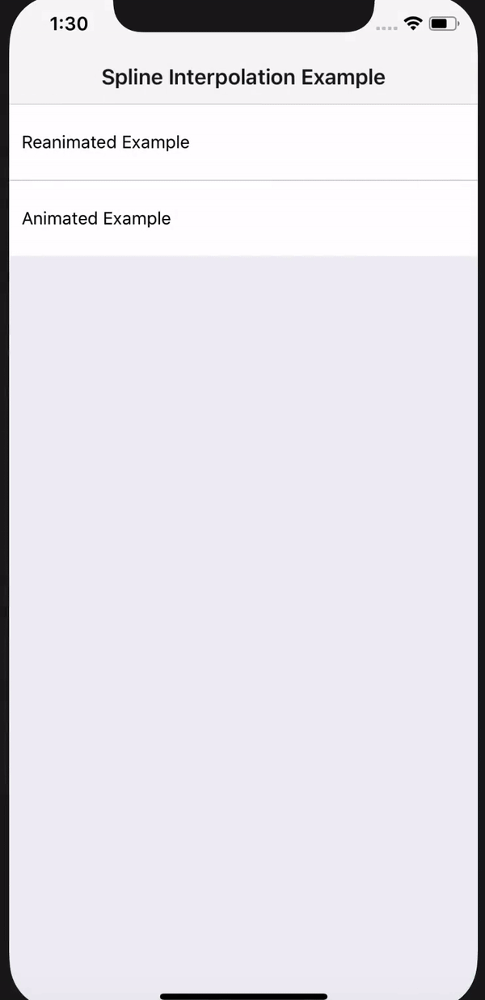

# react-native-spline-interpolate
&nbsp;&nbsp;&nbsp;&nbsp;

## Purpose
Provide API for declarative native spline third order interpolation in React Native in a linear complexity

## General
Code consists of three separated file which are supposed to be separated libraries in future.

- `splineInterpolation.js` 
gives math foundation for further calculation.
Firstly, it was made using Gaussian elimination and then optimized for O(n) complexity where n is a number of interpolation nodes.

It was applied to RN in two ways: using native core drivers 
and [`react-native-reanimated`](https://github.com/kmagiera/react-native-reanimated) library.

Decided to use this library as it allows for 'lazy' nodes evaluation. 
Particularly it means that nodes prepared for evaluating every range 
are evaluating each frame using native drivers and then... multiplied by zero or one :tada:.
`Reanimated` gives us condition nodes which does not evaluate its input if not needed.

It will be deeply explained in some paper in the future


## Usage
### core RN's `Animated` 
```javascript
import React, { Component } from "react";
import { View, Animated } from "react-native";
import { splineInterpolate } from "../../src/animatedSplineInterpolation";

const { multiply, Value, timing } = Animated;

const inputRange = [0, 20, 45, 70, 85, 100];
const outputRange = [100, 70, 60, 30, 35, 0];

export default class Example extends Component {
  _transX = new Value(0);
  _anim = timing(this._transX, {
    toValue: 100,
    duration: 5000
  }).start();
  render() {
    const interpolated = splineInterpolate(this._transX, { inputRange, outputRange });
    return (
      <View>
        <Animated.View
          style={{ transform: [{ translateX: interpolated }] }}
        />
      </View>
    );
  }
}

```

### `Reanimated`
```javascript
import React, { Component } from "react";
import { View } from "react-native";
import { splineInterpolate } from "../../src/reanimatedSplineInterpolation";
import Animated, { Easing } from "react-native-reanimated";

const { cond, multiply, startClock, stopClock, clockRunning, block, timing, Value, Clock } = Animated;

function runTiming() {
  const state = {
    finished: new Value(0),
    position: new Value(0),
    time: new Value(0),
    frameTime: new Value(0)
  };
  const clock = new Clock();
  const config = {
    duration: 5000,
    toValue: new Value(100),
    easing: Easing.linear
  };

  return block([
    cond(clockRunning(clock), 0, [startClock(clock)]),
    timing(clock, state, config),
    cond(state.finished, stopClock(clock)),
    state.position
  ]);
}

const inputRange = [0, 20, 70, 100];
const outputRange = [0, 40, 50, 100];
class Example extends Component {
  _transX = runTiming();
  render() {
    const interpolated = splineInterpolate(this._transX, { inputRange, outputRange });
    return (
      <View>
          <Animated.View
            style={{ transform: [{ translateX: interpolated }] }}
          />
      </View>
    );
  }
}
```

 
